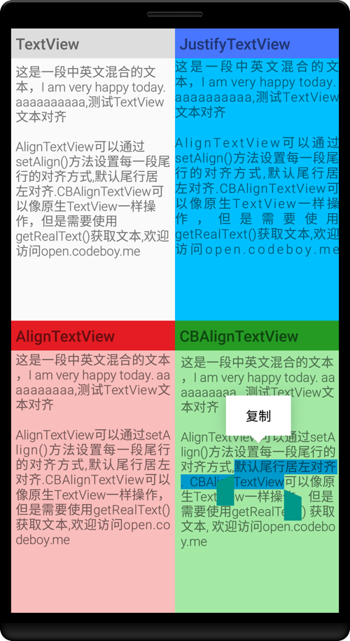

# AlignTextView
字体对齐的textview
  

  
## 系统要求
Android 4.0以上

## 快速使用

**build.gradle加入dependencies**

    compile 'me.codeboy.android:align-text-view:2.3.1'

**AlignTextView (不支持选择复制，在不需要进行选择复制的情况下使用，排版效果好)**

     <me.codeboy.android.aligntextview.AlignTextView
            android:id="@+id/alignTv"
            android:layout_width="match_parent"
            android:layout_height="wrap_content"/>

**CBAlignTextView (新的版本，支持选择复制，排版效果比较的好)**

    <me.codeboy.android.aligntextview.CBAlignTextView
            android:id="@+id/cbAlignTv"
            android:textIsSelectable="true"
            android:layout_width="match_parent"
            android:layout_height="wrap_content"/>

如果需要支持android默认的选择复制，请在xml中加入以下代码:

    android:textIsSelectable="true"

## 相关方法

#### 1.CBAlignTextView

CBAlignTextView中增加了以下方法获取TextView的文本内容，请不要使用getText()获取

    getRealText()
   
由于Android L(5.0)之后对中文的版本进行了变化，造成不能由中文标点作为行首，所以为了能够使CBAlignTextView看起来更加工整，建议将中文符号用英文符号替换(默认不转换)，可以通过以下三种方式转化

- 使用转化函数转化标点符号:

    CBAlignTextViewUtil.replacePunctuation(String text)
   
   
- 在设置CBAlignTextView文本前(setText),调用以下方法:
 
    setPunctuationConvert(boolean convert)
    

- 可以直接在xml布局中进行设置

        <LinearLayout xmlns:android="http://schemas.android.com/apk/res/android"
              xmlns:cb="http://schemas.android.com/apk/res-auto"
              android:layout_width="match_parent"
              android:layout_height="match_parent"
              android:orientation="vertical">
              <me.codeboy.android.aligntextview.CBAlignTextView
                    android:id="@+id/cbAlignTextView"
                    android:layout_width="match_parent"
                    android:layout_height="wrap_content"
                    cb:punctuationConvert="true"
                    android:textIsSelectable="true"
                    android:textSize="14dsp"/>    
        </LinearLayout>

#### 2.AlignTextView
AlignTextView是旧的版本，不支持选择复制，但是可以自定义最后一行的对齐方式

	setAlign(Align align)
	
设置每一段最后一行对齐方式，默认居左对齐  ，同时也可以在xml注释中设置对其方式:

	
        <LinearLayout xmlns:android="http://schemas.android.com/apk/res/android"
              xmlns:cb="http://schemas.android.com/apk/res-auto"
              android:layout_width="match_parent"
              android:layout_height="match_parent"
              android:orientation="vertical">
              <me.codeboy.android.aligntextview.AlignTextView
                    android:id="@+id/alignTextView"
                    android:layout_width="match_parent"
                    android:layout_height="wrap_content"
                    cb:align="center"
                    android:textSize="14dsp"/>    
        </LinearLayout>

## 使用说明
1.  不用进行选择复制的时候使用 `AlignTextView`,需要进行选择复制的时候使用`CBAlignTextView`。
2.  `AlignTextView`与`CBAlignTextView`在对齐的时候不会对英文单词等进行考虑，它们都是以字符(character)为基础的,不是词(word)。
3.  使用CBAlignTextView时建议进行中文标点的转换。 
4.  demo项目位与app下，可以单独提取出me.codeboy.android.aligntextview.AlignTextView和me.codeboy.android.aligntextview.CBAlignTextView使用。

## 更新历史
### v2.3.1
1. 修复CBAlignTextView在xml中设置text时空指针问题。
1. 修复CBAlignTextView设置空文本无效问题。

